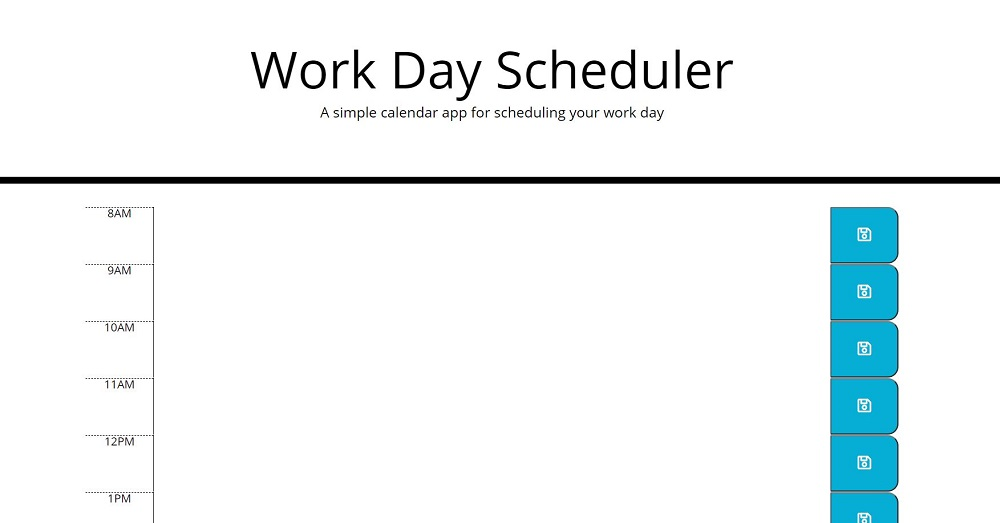

# work-day-scheduler
Work Day Scheduler

## Name
Word Day Scheduler

## Description
Designed a scheduler to add important events to a daily planner.

## Links
[Source Code](https://github.com/asantercureton/work-day-scheduler)

[Description Link](https://asantercureton.github.io/work-day-scheduler/)

## Usage
Presents user with a button to start the quiz and stores their highscore using localStorage once completed. Users will have a timed limit to complete the quiz and every incorrect answer deducts time from the remaining time left. Time is saved has a score and are viewable via the highscore link.

## Screenshots
Below is a screenshot of the project:

---
© 2021 Work Day Scheduler.